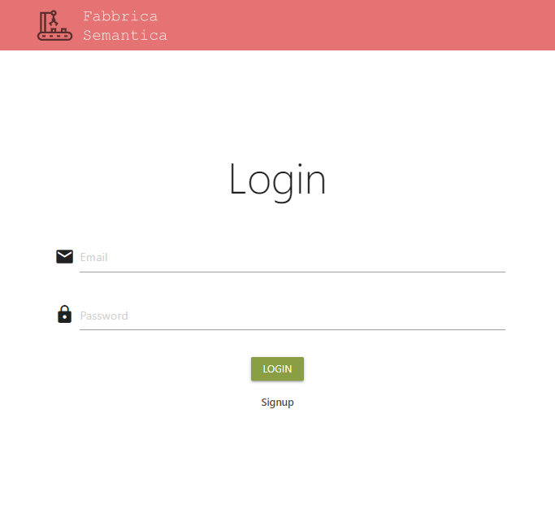
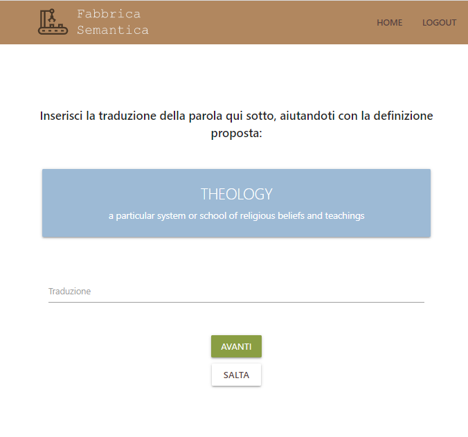
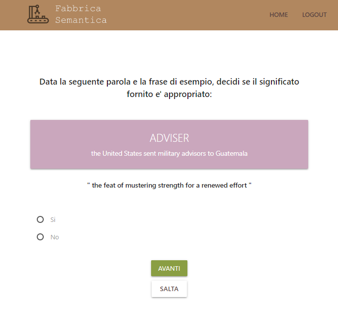
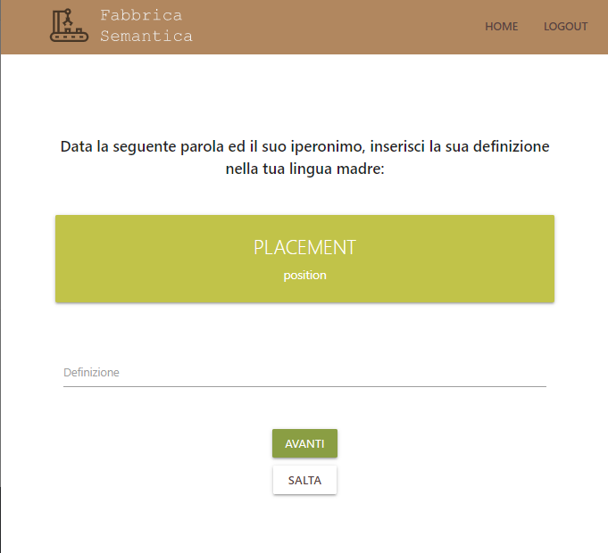
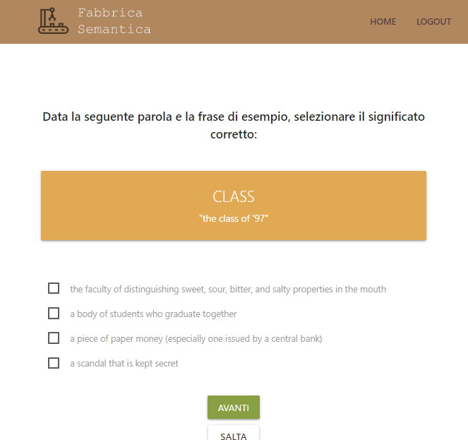
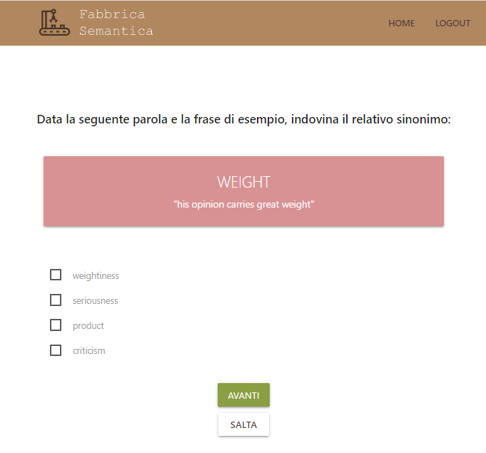

<h1>Translation Annotation Platform</h1>
✍🏻 A cute but useless translation/annotation web app.

<h3>Synopsis</h3>
This was an assignment for my university OOP course (Java based).
The professor asked for a simple app with specific features that asked users to write translations of English words in
their native language (only Italian is supported), annotate their definitions and validate other translations or
meanings.

Is it useful? nope.

Is it a fun and engaging game? probably not.

But I think it turned out pretty cute. 🎀

  
  
  
  
  
  

